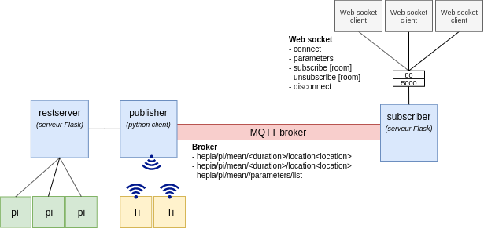

# Suivi de température

**Réalisé par :** Justin Foltz

**Date :** 01/2020

## Le Projet

Ce projet consiste à mettre en place une infrastructure permettant de suivre l'évolution de la température des salles de l'HEPIA. Les données sont recueillies auprès de Raspberry installés dans les différentes salles et auprès des modules Bluetooth à portée. Les informations sont affichées sous forme de graphiques sur une interface web. Il est possible de surveiller l'évolution de la température en direct ou de consulter l'historique des relevés.

## L'Architecture

Les données des Raspberry sont collectés par le *restserver* et communiqués au *publisher*. Ce dernier collecte les informations reçues par Bluetooth et transmet le tout au *subscriber* par le biais d'un broker MQTT. Le *subscriber* se charge de mettre en forme les données et de les afficher.



## Lancement de l'application

Construire et lancer la base de donnée (nécessaire pour le *subscriber*)

```bash
cd db
docker build . -t <name_container>:<version>
docker run --rm -p27017:27017 <name_container>:<version>
cd ..
```

Pour lancer le projet : 

```bash
source venv/bin/activate
python3 restServer.py
python3 mqtt_publisher.py
python3 mqtt_subscriber.py
```

Pour accéder aux données :

```bash
http://localhost:5001
```

